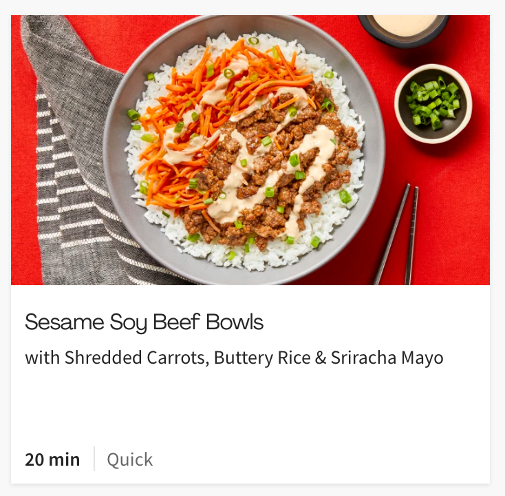
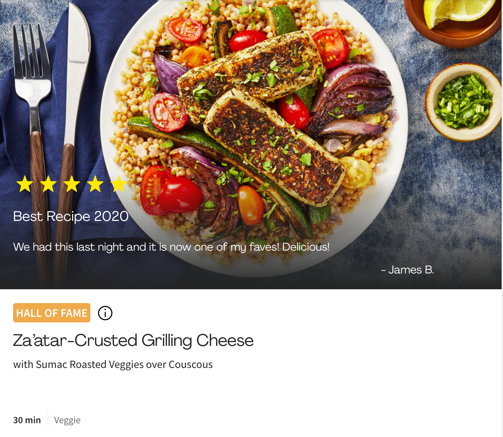

# How to approach this workshop
- Pair programming: Work together on this workshop but also follow along on your own computer by having your own copy of the workshop
- Do the discussion points! Discuss with your partner what something is and why one way may be better than another.
- How did you find the answer? A big part of this workshop is finding the answers on your own. Use Google and the Resources provided to help you through the workshop, but discuss with your partner the steps you took to find the answer.
- Save your progress. After each significant step, the workshop asks you to push up your code. In production applications we want to keep our commits small and commit often! Makes debugging easier.
- If you run out of time during the pair programming session, continue and finish this workshop on your own. Create a pull request when finished then reach out to @Tara Bird to review your code. If you have any questions along the way, I am happy to answer.

## Helpful Resources
- [HTML & CSS Rules](https://www.w3schools.com/)
- [How to CSS from beginner to advanced](https://css-tricks.com/)
- [Practice](https://www.codecademy.com/)
- [Online editor sandbox](https://codepen.io/)
- [Flexbox Cheat sheet](https://flexbox.malven.co/)
- [Accessible Color Contrast Helper](https://color.a11y.com)
- [More about Web Accessibility](https://developer.mozilla.org/en-US/docs/Learn/Accessibility/HTML)
- [GOOGLE IS YOUR BEST FRIEND!](http://www.google.com)

# Getting Started
- [ ] [FORK](https://docs.github.com/en/github/getting-started-with-github/fork-a-repo) this repo
- [ ] Clone the fork to your local machine and open in your favorite Code Editor
- [ ] [Create a new branch](https://git-scm.com/book/en/v2/Git-Branching-Basic-Branching-and-Merging) with your name
- [ ] Open up index.html in browser
- [ ] Open the [HF Menu Page](https://www.hellofresh.com/menus) in a separate browser tab. This is the page we will be building.
- [ ] Open your [Browser Dev Tools](https://balsamiq.com/support/faqs/browserconsole/#:~:text=To%20open%20the%20developer%20console,(on%20Windows%2FLinux).) for the [HF Menu Page](https://www.hellofresh.com/menus) so you can inspect the HTML and CSS as you work.

# The Workshop

## index.html
### Discussion:
- Why is this file specifically named "index.html"?
- What are the benefits of using this file name versus another name like "recipes.html"?

## Add an HTML meta title
- Go to https://www.hellofresh.com/menus, what's the title that we use here?
- [ ] Add it to your HTML file.

## Add normalize.css
### Discussion:
- What is normalize css?
- Why do we want to use it?
### Requirements:
- [ ] Link the provided normalize.css file to your HTML document

## Create a stylesheet & Link it to HTML
- [ ] Create a file called "style.css"
- [ ] Link style.css to your HTML

## Add a Google Font
- [ ] Pick a font on https://fonts.google.com/
- [ ] Add your chosen font to your HTML
- [ ] Make sure all of your text is using this new font.

## Commit & Reflect
- [ ] Push up your current code changes with a descriptive commit to your branch (not Master branch) in github
### Discussion:
- Why should normalize.css (and other vendor CSS) go BEFORE style.css?
- Google Fonts gives you two options for embedding the CSS `<link>` and `@import`, what is the difference between the two?
- Google Fonts provides you a `<link>` with a attribute `rel="preconnect"` what is preconnect?
- What is another link `rel` that helps with performance?

## Add Semantic HTML to make it more Accessible
- [ ] For this workshop, you must use `<nav /> <header /> <main />`
- [ ] Add 3 more semantic HTML tags that were not used above

## Headings
### Discussion:
- What are heading tags?
- Why do we want to use them?
### Requirements:
- [ ] Add H1, H2, H3 tags to the HTML

## Images must be accessible
- [ ] Have an "alt" text to all images

## Commit & Reflect
- [ ] Push up your current code changes with a descriptive commit to your branch (not Master branch) in github
### Discussion:
- Why do we need accessibility?
- How do "alt" tags help images and accessibility?

## Style the header
- [ ] Logo should only be 30px tall
- [ ] Links must be inline with 30px padding between each link
- [ ] When a link is hovered on, the background must be a light green with dark green text color (see [HF Menu Page](https://www.hellofresh.com/menus) for exact colors)
- [ ] Change the link target to open in the current browser tab rather than a new window
- [ ] Add "title" text to all links to make it more accessible

## Commit & Reflect
- [ ] Push up your current code changes with a descriptive commit to your branch (not Master branch) in github
### Discussion:
- What is the difference between `<ul></ul>` and `<ol><ol>`?
- We removed the bullet points for our links in our `<ul />` but what are some other bullet point types you can specify?

## Style Menu Cards

### Make the recipe cards look like this:

### Discussion:
- What are the different ways we can add 3 rows of recipe cards?
- What is the best way?
### Requirements
- [ ] Card must have a drop shadow
- [ ] Recipe cards must have Light gray background
- [ ] Use a different google font for the Recipe Name
- [ ] Image should be on top and take up entire space of to the top and sides of the card
- [ ] Title size must be 16px and Description size must be 14px
- [ ] At the bottom left, we tell user how long it will take to cook (in bold) and display its labels in dark gray
- [ ] The recipe description text should only span one line. If the text is too big, have it ellipses at the end. (I.E. with Roasted Veggies, Cucumber Raita & Garlic Bas...)

## Commit & Reflect
- [ ] Push up your current code changes with a descriptive commit to your branch (not Master branch) in github
### Discussion:
- We use flexbox a lot at HelloFresh. What are the benefits of Flexbox?
- What are the different options for "overflow"?

## Style Hall of Fame Cards

### Discussion:
- What is an SVG?
- How is it different from an image?
### Requirements
- Find the `

`
- [ ] Change the color of the stars to be yellow
- [ ] Card must be as tall as two cards and fit the length of the container (as we currently do on the [HF Menu Page](https://www.hellofresh.com/menus))
- [ ] Image must be 728px tall
- [ ] Review text must overlap the image and review author's name must be on the right with the rest of the review text left aligned
- [ ] Add a "Hall of fame" label with an orange background. Use the same color we use on the [HF Menu Page](https://www.hellofresh.com/menus)).

## Commit & Reflect
- [ ] Push up your current code changes with a descriptive commit to your branch (not Master branch) in github
### Discussion:
- What are the different positions an HTML element can have?
- Specify one situation for each type of position.

### Sticky Footer
- [ ] Make the footer with the "Get cooking" button sticky to the bottom of the page.
- [ ] Currently the "Get cooking" Footer link doesn't work. Make it go to the [HelloFresh Plans Page](https://www.hellofresh.com/plans)
- [ ] Style this link to look like a button

## Commit & Reflect
- [ ] Push up your current code changes with a descriptive commit to your branch (not Master branch) in github
### Discussion:
- What's the difference between margin and padding?
- If I had an element with a border, you will see by default that the border is NOT accounted for in the height and width. How would I change this so that the border is accounted for in the height and width calculations?
- What is the CSS Box Model?
- Padding area is one element that makes up the CSS Box Model, what are the other elements?

### Advanced

## Make the page responsive and look good on mobile

### Discussion:
- How do you add styles just to the mobile view?
### Requirements:
- [ ] When in Mobile view Hall of Fame recipes become the same size as all the other recipe cards
- [ ] When in Mobile view you will only have 1 recipe card per row

# Finish
- [ ] [Create a pull request](https://docs.github.com/en/github/collaborating-with-issues-and-pull-requests/creating-a-pull-request) when finished then reach out to @Tara Bird to review your code.
